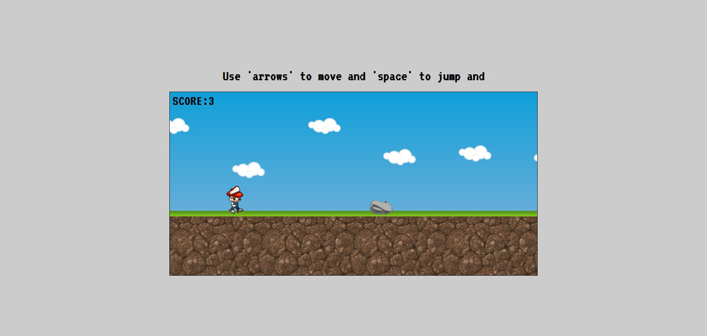
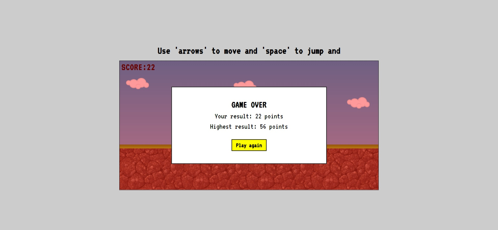

# "Don't touch the rock" - simple game

## Table of contents
* [General info](#general-info)
* [Technologies](#technologies)
* [Live demo](#live-demo)
* [Screenshots](#screenshots)
* [Source](#source)

## General info
I would like to introduce you to the game written by myself. All you need to do is running and avoiding rocks. Use 'left and right arrows' to change direction and increase your pace and of course 'space' to jump above obstacles. Let's test yourself and try to beat your own highscore.

## Technologies
* HTML5
* CSS3
* Sass
* JavaScript
* OOP

## Live demo
 * A live demo can be found [here](https://mobbyschiller.github.io/)

## Screenshots

## Source
Here you can find source of assets.
https://www.gameart2d.com/
https://craftpix.net/
